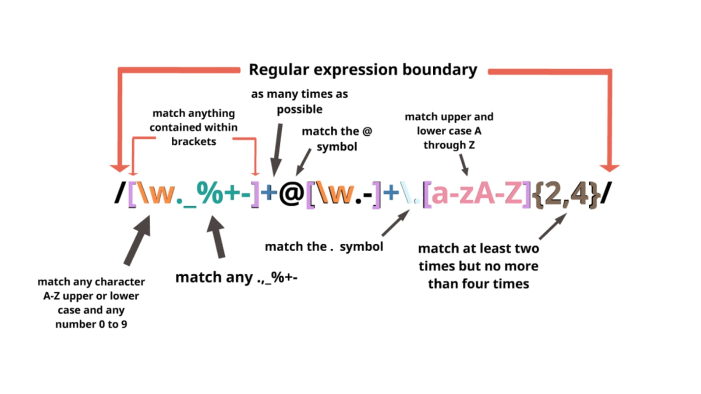

# Regular expression

A regular expression is a sequence of characters that specifies a search pattern. Usually, such patterns are used by string-searching algorithms for "find" or "find and replace" operations on strings, or for input validation. It is a technique developed in theoretical computer science and formal language theory. for instance:





## User Story

```md
AS A web development student
I WANT a tutorial explaining a specific regex
SO THAT I can understand the search pattern the regex defines
```


## Summary

Short for regular expression, a regex is a string of text that allows you to create patterns that help match, locate, and manage text. Regular expressions are particularly useful for defining filters. Regular expressions contain a series of characters that define a pattern of text to be matched—to make a filter more specialized or general.

I choose Regular Expression Matching an HTML Tag: `/^<([a-z]+)([^<]+)*(?:>(.*)<\/\1>|\s+\/>)$/`

## Table of Contents

- [Anchors](#anchors)
- [Quantifiers](#quantifiers)
- [Grouping Constructs](#grouping-constructs)
- [Bracket Expressions](#bracket-expressions)
- [Character Classes](#character-classes)
- [The OR Operator](#the-or-operator)
- [Flags](#flags)
- [Character Escapes](#character-escapes)

## Regex Components
Let's start by breaking down the expression /^<([a-z]+)([^<]+)*(?:>(._)</\1>|\s+/>)$/ :

- /
  - ^
  - <
  - (
  - [a-z]
  - `+`
  - )
  - (
  - [^<]
  - `+`
  - )
  - `*`
  - (
  - ?:
  - >
  - (
    - .
    - _
  - )
  - <
  - /
  - \1
  - >
  - |
  - \s
  - `+`
  - /
  - >
  - )
  - $
  - /

### Anchors

Anchors, or atomic zero-width assertions, specify a position in the string where a match must occur. When you use an anchor in your search expression, the regular expression engine does not advance through the string or consume characters; it looks for a match in the specified position only. To match HTML Tags this regex uses the anchors: ^, and $.

- <span style="background-color: #FAF0E6; color :black;">^abc$ </span> -^ start / $ end of the string
  - <span style="background-color: #D3D3D3; color :black;">^ </span> Matches the beginning of the string, or the beginning of a line if the multiline flag (m) is enabled. This matches a position, not a character. In this case, it should start with "<" because we are looking for an HTML Tag and those begin with "<".

  - <span style="background-color: #D3D3D3; color :black;">\ </span> Allows the regex to "escape" certain characters that, without the "", would otherwise perform an action we don't want the character to perform.

  - <span style="background-color: #D3D3D3; color :black;">$ </span>Matches the end of the string, or the end of a line if the multiline flag (m) is enabled. This matches a position, not a character.


### Quantifiers

Quantifiers specify how many instances of a character, group, or character class must be present in the input for a match to be found. A quantifier can be greedy or lazy that is explained below. To match HTML Tags this regex uses the quantifiers: +, ?, and *.

- <span style="background-color: #D3D3D3; color :black;">`+` </span>  Tells the regex to look for one or more of the preceding tokens. We first see + being used with [a-z] meaning that the regex is to match one or more of the characters ranging from a-z.

  <span style="color:gold">Example : </span> xyz+ matches a string that has xy followed by one or more z
- <span style="background-color: #D3D3D3; color :black;"> `?`</span> Matches a string that has the anterior followed by zero or one of the last character.

  <span style="color:gold">Example : </span>xyz? would match a string containing xy followed by zero or one z. However, this ? is used in conjunction with :. These two together create ?: which is used to signal a non-capturing group.

- <span style="background-color: #D3D3D3; color :black;">`*`</span> Informs our regex to match 0 or more of the preceding code. We first see * being used with ([^<]+) making the contents of () optional. 

  <span style="color:gold">Example : </span> xyz* would match a string containing xy followed by zero or more z.

### Grouping Constructs

Grouping constructs delineate the subexpressions of a regular expression and capture the substrings of an input string. You can use grouping constructs to match a subexpression that is repeated in the input string and apply a quantifier to a subexpression that has multiple regular expression language elements. Grouping and Capturing come into play when we want to use regex with our preferred programming language. Grouping and Capturing uses () (parenthesis) to match a specific pattern in a string. We see Grouping and Capturing done in multiple places with our regex: ([a-z]+) and ([^<]+). 

<span style="background-color: #D3D3D3; color :black;">(?:) </span>
 This combination ?: tells our regex to disable the capturing group. We see this as (?:>(._)</\1>|\s+/>) in our regex. 

<span style="color:gold;"> Example : </span> /(flavor)/ would match "flavor" while ( a) would match all "a"'s with whitespace preceding it. Specifically for our regex the grouping ([a-z]) would match any character ranging from a-z.


### Bracket Expressions

A bracket expression is either a matching list expression or a non-matching list expression. It consists of one or more expressions: ordinary characters, collating elements, collating symbols, equivalence classes, character classes, or range expressions. We see several examples of this in our regex the first being [a-z].

<span style = "color: gold; "> Example :</span> [xyz] is the same as x|y|z.

### Character Classes

Character classes match a character from a specific set. There are a number of predefined character classes and you can also define your own sets. To match HTML Tags this regex uses the character classes: \s, and . .

- <span style="background-color: #D3D3D3; color :black;">\s </span>  Matches any whitespace character. We see \s being used in our non-capturing group. 
- <span style="background-color: #D3D3D3; color :black;">. </span> Matches any character except line breaks. 


### The OR Operator
To match HTML Tags this regex uses the OR Operators: [ ] and | . 
- <span style="background-color: #D3D3D3; color :black;">|  </span>  is used with () to match a preceding string with one of the contents contained within ()and does so WHILE capturing the contents contained with (). 

   <span style="color:gold">Example : </span> x(y|z) would match xy or xz.

- <span style="background-color: #D3D3D3; color :black;">[ ]  </span> Matches a string that is followed by one of the characters inside the [] and does so WITHOUT capturing the contents contained within []. We see several examples of this in our regex the first being [a-z].

   <span style="color:gold">Example : </span>x[yz] would match xy or xz.


### Flags

Expression flags change how the expression is interpreted. Flags follow the closing forward slash of the expression.

- <span style="background-color: #D3D3D3; color :black;">i</span> Ignores case
- <span style="background-color: #D3D3D3; color :black;">g </span> Global search retains the index of the last match, allowing subsequent searches to start from the end of the previous match. Without the global flag, subsequent searches will return the same match.
- <span style="background-color: #D3D3D3; color :black;">m </span> Multiline flag When the multiline flag is enabled, beginning and end anchors (^ and $) will match the start and end of a line, instead of the start and end of the whole string.
- <span style="background-color: #D3D3D3; color :black;">u </span> Unicode
- <span style="background-color: #D3D3D3; color :black;">y </span>The expression will only match from its lastIndex position and ignores the global (g) flag if set. Because each search in RegExr is discrete, this flag has no further impact on the displayed results.

<span style="color:green;"> NOTE: </span> Unicode is an information technology standard for the consistent encoding, representation, and handling of text expressed in most of the world's writing systems.


### Character Escapes

The backslash in a regular expression precedes a literal character. You also escape certain letters that represent common character classes, such as \w for a word character or \s for a space. 

 <span style="color:gold">Example :</span>  the open curly brace ({) is used to begin a quantifier, but adding a backslash before the open curly brace (\{) means that the regex should look for the open curly brace character instead of beginning to define a quantifier. This is common when looking for strings with special characters that are the same as a particular component of a regex.

It's important to note that all special characters, including the backslash (\), lose their special significance inside bracket expressions.

## Author

<span style="color:#b3265c; font-family:Tahoma; font-weight:bold;">Elham Bazazzadeh </span> <span style="color:#84f1f3; font-family:Tahoma;"> at the Bootcamp of the University of Washington.</span>

Refrences :

Microsoft. (2021).Grouping Constructs in Regular Expressions(2021). https://docs.microsoft.com/en-us/dotnet/standard/base-types/grouping-constructs-in-regular-expressions

 Microsoft. (2021).  Regular Expression Language - Quick Reference. https://docs.microsoft.com/en-us/dotnet/standard/base-types/regular-expression-language-quick-reference

alesanchezr, . (2021).  Regex Tutorial: Learn With Regular Expression Examples. https://content.breatheco.de/en/lesson/regex-tutorial-regular-expression-examples

 (2021).  Generating Test Data using Regular Expressions with Java. https://westergaard.eu/2019/08/generating-test-data-using-regular-expressions-with-java/
